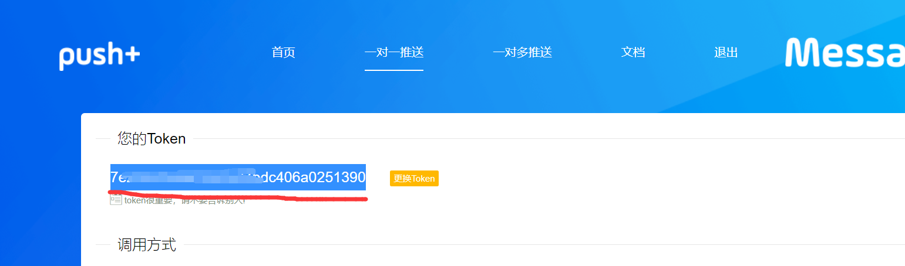

# 西南大学今日校园自动签到-python
# 纯python实现的今日校园自动打卡
# 本项目仅供学习交流使用，如作他用所承受的任何直接、间接法律责任一概与作者无关
### ***10.26更新说明:这次更新之后，因为添加了新的aes模块，部分很久以前部署的同学可能无法正常使用，请更新一下层，如果不会，按教程重新部署一遍即可***
## 优点:
#### - 1.懒人版不需要配置签到地址等信息，自动根据昨天打卡地址打卡
#### - 2.代码可以热更新，部署一次，基本上不用再管，需要更新签到地址时只需要在手机上更新一次签到即可
#### - 3.不依赖于第三方登录服务器，信息更安全
#### - 4.灵活度高，更新简单，今日校园更新，项目可以很快跟进
#### - 5.模块化程度高，添加~~查寝~~(已添加)和信息收集简单
#### 看不到图片？[点我](https://hub.fastgit.org/F-19-F/SWU-CpDaily)
## 使用方法
### 单用户懒人版
#### - 1.打开[腾讯云云函数](https://console.cloud.tencent.com/scf)并扫码登录,完成实名认证
#### - 2.进入层，选择新建层 
#### - 3.将项目中的Packages.zip(可以在[release](https://github.com/F-19-F/SWU-CpDaily/releases/tag/1.1)中下载，clone后用项目中的也可以)上传到层中，运行环境选择python3.6 
#### - 4.进入函数服务，选择新建 
#### - 5.按照图设置好，名称自己定，运行环境选择python3.6 
#### - 5.复制下面这几行代码到云函数到在线代码编辑器中，用学号替换"你的学号"，用密码替换"你的密码",其他选项根据需要修改    
```
#######必填选项##############
#CLOUDUSERNAME学号
CLOUDUSERNAME='你的学号'
#CLOUDPASSWORD密码
CLOUDPASSWORD='你的密码'
#######以下部分非必填########
#签到延迟，默认准点
CLOUDDELAY=0
#######################################
#CLOUDPUSHTOKEN 微信推送打卡日志的token可填可不填
CLOUDPUSHTOKEN=''
#CLOUDPUSH_LEVEL:推送级别，默认同时推送成功和失败消息,根据需要修改
#消息推送的级别
#0.仅推送失败消息
#1.推送成功和失败消息
#2.发送详细日志
CLOUDPUSH_LEVEL=1
#######################################
#百度OCR的密钥，用于验证码登录，一般可以不填
CLOUDAPP_ID=''
CLOUDAPI_KEY=''
CLOUDSECRET_KEY=''
#######################################
import urllib.request
req=urllib.request.Request(url='https://raw.fastgit.org/F-19-F/SWU-CpDaily/master/index.py',headers={"User-Agent":"Mozilla/5.0 (Windows NT 10.0; Win64; x64) AppleWebKit/537.36 (KHTML, like Gecko) Chrome/91.0.4472.106 Safari/537.36"},method='GET')
res=urllib.request.urlopen(req)
code=res.read().decode('utf-8')
exec(code)
##########一定要复制到这里#############
```

#### - 6.往下拉，将高级配置中的执行超时时间设为60s 
#### - 7.进入层配置，选择添加层 
#### - 8.选择第一步创建的层 
#### - 9.保存 
#### - 10.打开刚才创建的云函数 
#### - 11.拉到最底下测试一下 
#### - 12.等待测试出来结果，正常情况结果如图    
#### - 13.进入触发管理，新建触发，并按图设置，Cron表达式"30 59 06,18 * * * *"表示每天6:50:30和18:59:30执行签到，程序会自动等待至签到时间签到 
#### - 如果想把签到结果推送到微信，请打开[PUSH](https://www.pushplus.plus/push1.html)扫码关注公众号后复制网页中的token到代码中token对应的位置,签到日志会通过公众号发送到你的微信 
## Enjoy it!


#### 5.19更新说明:身份证带X的同学，密码没有被重置，可以不修改密码正常使用，身份证不带X的同学，需要自己用默认密码登录后修改密码
##  最后注意一下，这个只针对西南大学哦，其他学校可以按照这个项目的思路改写